# Advanced Lane Finding Project

### 專案路徑布局

```
├── Advanced_Lane_Lines.py
├── project_video.mp4				# Project 影像
├── challenge_video.mp4				# 挑戰 1) 影像
├── harder_challenge_video.mp4		# 挑戰 2) 影像
├── __init__.py	
├── LICENSE
├── image_processing				# 所有pipline中使用到的function都在此資料夾底下
│   ├── camera_cal					# 校正相機使用的影像
│   │   └── .....					
│   ├── calibration.py				# 校正相機function
│   ├── wide_dist_pickle.p			# 存放校正相機後得到cameraMatrix & distCoeffs數值
│   ├── edge_detection.py			# 檢測邊緣function,像sobel,color transforms等等 
│   ├── find_lines.py				# 找出車到線function
│   ├── transform.py				# 轉換測試程式,用來調整測試參數用
│   ├── line_fit_fix.py				# 檢測找車道function是否有正確找出車道
│   ├── preprocessing.py			# 影像遮罩，將不重要地方遮罩掉
│   └── __init__.py	
├── examples						# 執行結果範例
│   └── .....
├── test_images						# 測試影片
│   └── .....
├── output_images					# 測試影片輸出資料夾
│   └── .....
├── output_video					# 測試影像輸出資料夾
│   ├── project_video_long_line.avi		# 使用較長的道路檢測
│   └── project_video_short_line.avi	# 使用較短的道路建測
└── README.md

```

---

### Camera Calibration

程式位置： [calibration.py](./image_processing/calibration.py) (校正值mtx, dist在這裡取得)

 [calibration.py](./image_processing/calibration.py) 裡面分為兩個function：`found_chessboard()`, `camera_cal()`

`found_chessboard()`: 用來找出棋盤的corners。
`camera_cla()`: 用來計算出cameraMatrix, distcoeffs。

程式片段：影像校正使用opencv undistortion函式，並透過 [calibration.py](./image_processing/calibration.py) 得到src, dst後就可以套入`cv2.undistort`函數校正。

```python
objpoints, imgpoints = found_chessboard()
mtx, dist = camera_cal(objpoints, imgpoints)
image = cv2.undistort(image, mtx, dist, None, None)
```

下圖為校正前和校正後的比較圖，左圖為原始圖，又圖為校正後結果

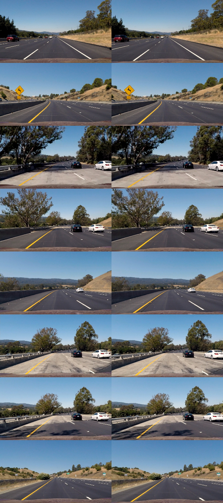

---

### Edge Detection

程式位置： [edge_detection.py](./image_processing/edge_detection.py)

 [edge_detection.py](./image_processing/edge_detection.py) 裡有許多gradients 方法的函式，如果單執行[edge_detection.py](./image_processing/edge_detection.py) 的話可以顯示出每個function的執行結果，透過多次的觀察及調整參數整理出最有用的方法。所以最後決定HSV color space 來偵測 **yello and white color **和RGB color space 偵測R channe。

程式片段：

```python
def combing_color_thresh(img):
    # hsv yellow and white
    yellow_low = np.array([0, 80, 100])
    yellow_high = np.array([50, 255, 255])
    white_low = np.array([18, 0, 180])
    white_high = np.array([255, 80, 255])
    hsv = cv2.cvtColor(img, cv2.COLOR_BGR2HSV)
    mask_yellow = cv2.inRange(hsv, yellow_low, yellow_high)
    mask_white = cv2.inRange(hsv, white_low, white_high)

    # RGB RED channel
    thresh = (215, 255)
    binary = np.zeros_like(img[:, :, 2])    # RED channel
    binary[(img[:, :, 2] > thresh[0]) & (img[:, :, 2] <= thresh[1])] = 255

    # combined mask
    combined_mask_yw = cv2.bitwise_or(mask_yellow, mask_white)
    combined_mask = cv2.bitwise_or(combined_mask_yw, binary)

    return combined_mask
```


圖像中可以發現每種detecti方法都可以抓到不同的線，但是仍有不足的地方，要達到完美只能花時間測試。

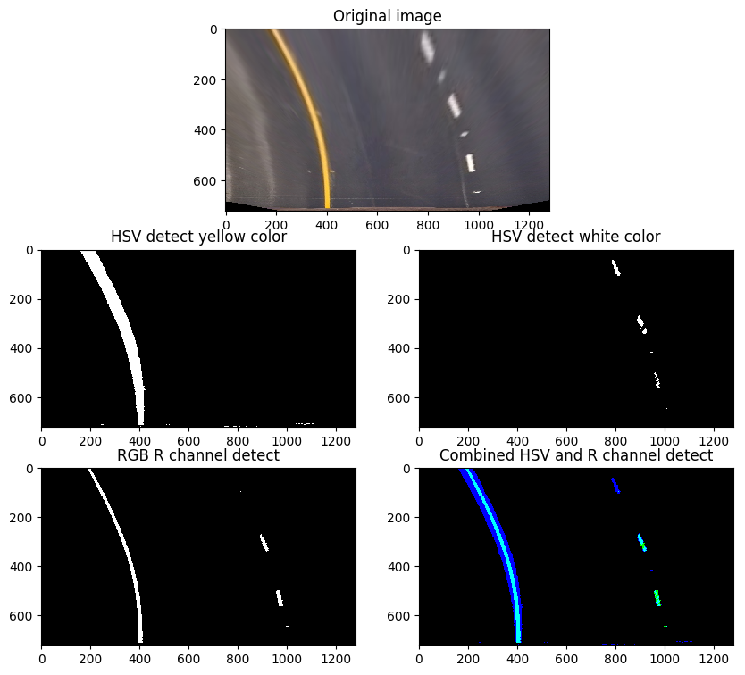

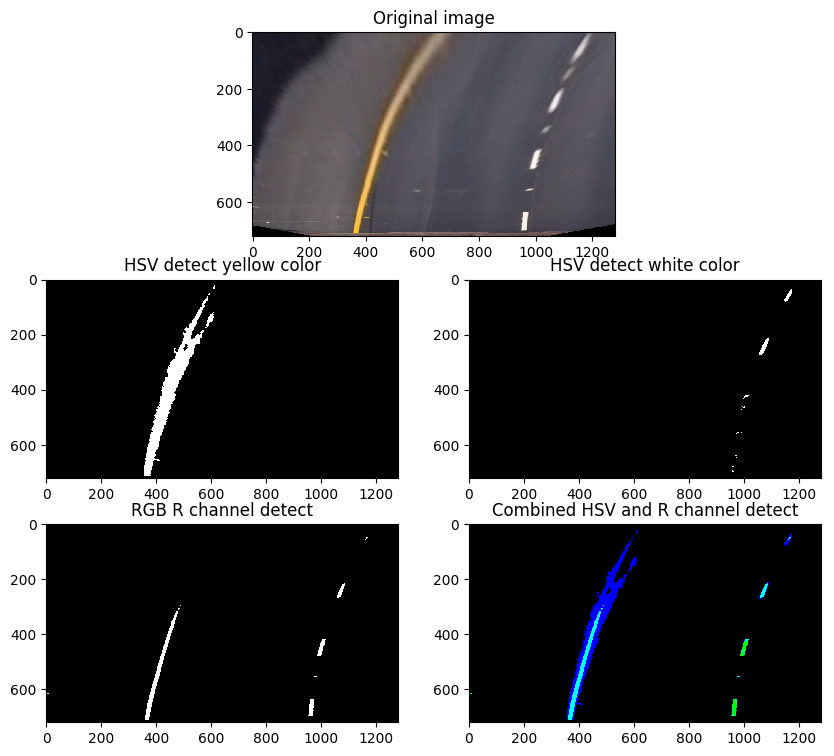

---

### Brid View

程式位置：[transform.py](./image_processing/transform.py)

主程式中的src, dst 參數是在此程式中多次測試得到的。

程式片段：

```python
offset = img.shape[1] / 2
src = np.float32([(578, 460), (704, 460), (1120, 720), (193, 720)])
dst = np.float32([(offset-300, 0), (offset+300, 0), (offset+300, 720), (offset-300, 720)])
# use cv2.getPerspectiveTransform() to get M, the transform matrix
perspective_M = cv2.getPerspectiveTransform(src, dst)
# use cv2.warpPerspective() to warp your image to a top-down view
img_out = cv2.warpPerspective(img, perspective_M, img.shape[1::-1], flags=cv2.INTER_LINEAR)
```

首先我們需要先找出src的位置，以直線的車道為基準，而dst為warp的目標位置。

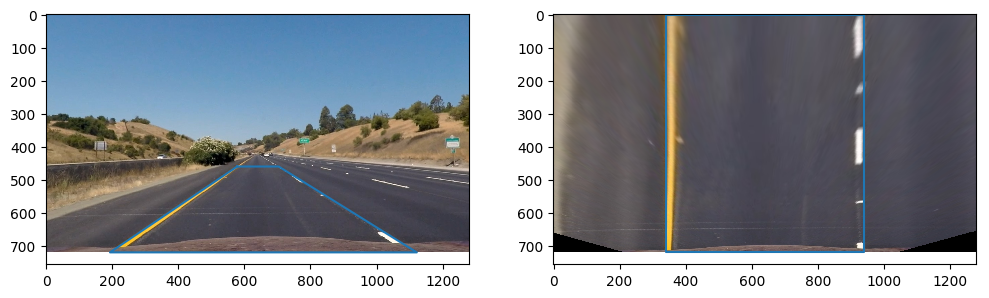

然後使用轉彎圖像來測試

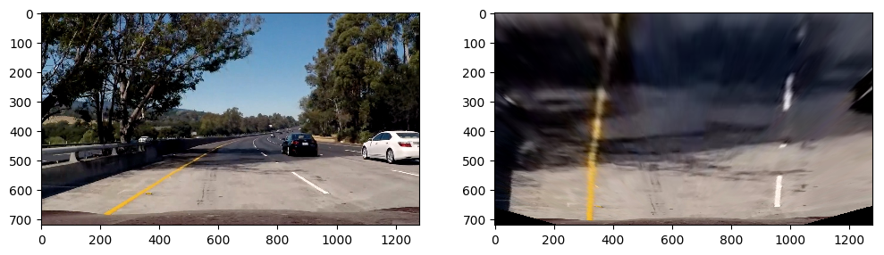

取較深的車道會得到不同結果：

`src = np.float32([(596, 447), (683, 447), (1120, 720), (193, 720)])`

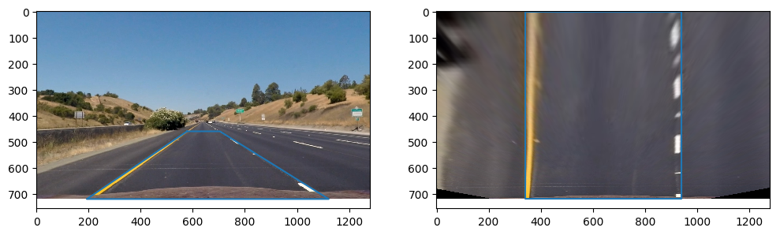

然後使用轉彎圖像來測試

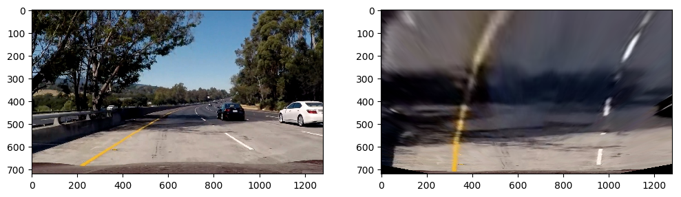

---

### Finding Lines

程式位置：[find_lines.py](./image_processing/find_lines.py)

這個程式碼內部包含了許多函式。

1. **find line：**函式包含了課堂介紹的`conv_sliding_search()` 和`histogram_search()`兩種方法，經過測試使用histogram search的方法效果比較好。

   程式片段：

   ```python
   def histogram_search(binary_warped):
   					
   	# ------------- 省略 -------------#

       # Fit a second order polynomial to each
       left_fit = np.polyfit(lefty, leftx, 2)
       right_fit = np.polyfit(righty, rightx, 2)

       # Generate x and y values for plotting
       ploty = np.linspace(0, binary_warped.shape[0] - 1, binary_warped.shape[0])
       left_fitx = left_fit[0] * ploty ** 2 + left_fit[1] * ploty + left_fit[2]
       right_fitx = right_fit[0] * ploty ** 2 + right_fit[1] * ploty + right_fit[2]

       # Draw the car path on the wrap images
       wrap_path = draw_path_way(binary_warped, left_fitx, right_fitx, ploty)

       # Determine the curvature of the lane 
       curv = measure_curv(left_fitx, right_fitx)
       
       # Determine vehicle position with respect to center.
       center = measure_center_dist(left_fitx[-1], right_fitx[-1])
       if center > 0:
           left_or_right = "right"
       else:
           left_or_right = "left"

       return wrap_path, curv, center, left_or_right, left_fit, right_fit, leftx, rightx
   ```

   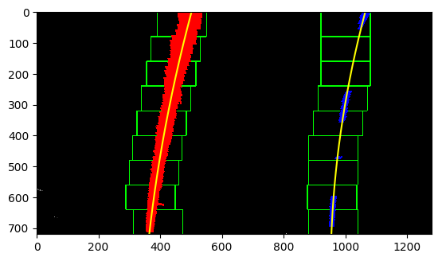

2. **Calculate  Radius of Curvature：**`measure_curv`測量曲率半徑。

   程式片段：

   ```python
   def measure_curv(left_fitx, right_fitx):
       # Define y-value where we want radius of curvature
       ploty = np.linspace(0, 719, num=720)
       # I'll choose the maximum y-value, corresponding to the bottom of the image
       y_eval = np.max(ploty)

       # Define conversions in x and y from pixels space to meters
       ym_per_pix = 30 / 720  # meters per pixel in y dimension
       xm_per_pix = 3.7 / 700  # meters per pixel in x dimension

       # Fit new polynomials to x,y in world space
       left_fit_cr = np.polyfit(ploty * ym_per_pix, left_fitx * xm_per_pix, 2)
       right_fit_cr = np.polyfit(ploty * ym_per_pix, right_fitx * xm_per_pix, 2)
       # Calculate the new radii of curvature
       left_curverad = ((1 + (2 * left_fit_cr[0] * y_eval * ym_per_pix + left_fit_cr[1]) ** 2) ** 1.5) / np.absolute(2 * left_fit_cr[0])
       right_curverad = ((1 + (2 * right_fit_cr[0] * y_eval * ym_per_pix + right_fit_cr[1]) ** 2) ** 1.5) / np.absolute(2 * right_fit_cr[0])
       
       return (left_curverad + right_curverad) / 2
   ```

   ​

3. **Calcalate car distance from path center：**`measure_center_dist()`測量車輛離車道中心多遠。

   程式片段：

   ```python
   def measure_center_dist(left_botton_pixel, right_bottom_pixel, img_width=1280):
       x = 3.7 * img_width / (right_bottom_pixel - left_botton_pixel)
       road_center = (right_bottom_pixel + left_botton_pixel) / 2
       car_center = (img_width / 2)
       dist = (car_center - road_center) / img_width * x
       return dist
   ```

   ​

4. **Draw Path：**`draw_path_way()`畫出車路徑，這個函數會傳回。

   程式片段：

   ```python
   def draw_path_way(binary_warped, left_fitx, right_fitx, ploty):
       # Create an image to draw the lines on
       warp_zero = np.zeros_like(binary_warped).astype(np.uint8)
       color_warp = np.dstack((warp_zero, warp_zero, warp_zero))

       # Recast the x and y points into usable format for cv2.fillPoly()
       pts_left = np.array([np.transpose(np.vstack([left_fitx, ploty]))])
       pts_right = np.array([np.flipud(np.transpose(np.vstack([right_fitx, ploty])))])
       pts = np.hstack((pts_left, pts_right))

       # Draw the lane onto the warped blank image
       cv2.fillPoly(color_warp, np.int_([pts]), (0, 255, 0))
       return color_warp
   ```


   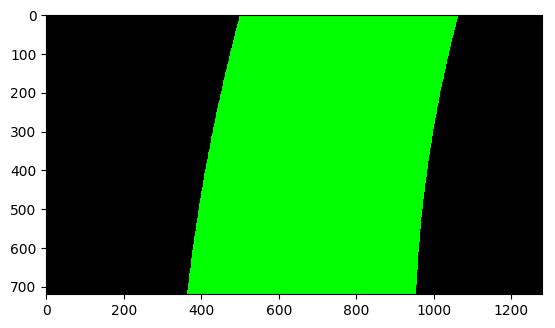

   5. **Convert brid view back**

      要從俯視圖轉換回原本視角方法與俯視圖轉換很像，在`cv2.getPerspectiveTransform() 中調換src, dst兩的參數即可。

      程式片段：

      ```python
      src = np.float32([(578, 460), (704, 460), (1120, 720), (193, 720)])
      dst = np.float32([(offset-300, 0), (offset+300, 0), (offset+300, 720), (offset-300, 720)])
      inver_perspective_M = cv2.getPerspectiveTransform(dst, src)
      warp_back = cv2.warpPerspective(color_warp, inver_perspective_M, (image.shape[1], image.shape[0]))

      ```

      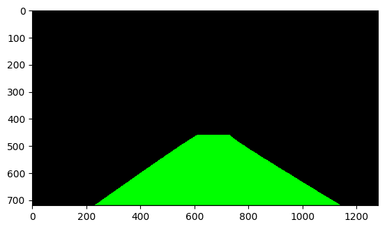

---
### Pipeline

將以上介紹的方法，改寫成一個函式，並新增了連續影像histogram_search的處理方法。

```python
def process_video(image, show_birdview=False):
    global count_h1, count_h2
    # Apply a distortion correction to raw images.
    image = cv2.undistort(image, mtx, dist, None, None)

    # Use color transforms, gradients to find the object edge and change into binary image
    image_binary = combing_color_thresh(image)

    # Transform image to bird view
    image_bird_view = cv2.warpPerspective(image_binary, perspective_M, image.shape[1::-1], flags=cv2.INTER_LINEAR)

    # find the road lines, curvature and distance between car_center and road_center
    if not left_line.detected or not right_line.detected:
        color_warp, curv, center, left_or_right, left_line.new_fit, right_line.new_fit, 
        left_line.allx, right_line.allx = histogram_search(image_bird_view)
        count_h1 += 1
    else:
        color_warp, curv, center, left_or_right, left_line.new_fit, right_line.new_fit, 		left_line.allx, right_line.allx = histogram_search2(image_bird_view, 
        left_line.best_fit, right_line.best_fit)
        count_h2 += 1

    # Check the lines health
    left_line.fit_fix()
    right_line.fit_fix()

    # Warp the blank back to original image space using inverse perspective matrix (Minv)
    warp_back = cv2.warpPerspective(color_warp, inver_perspective_M, (image.shape[1], image.shape[0]))

    # Combine the result with the original image
    img_out = cv2.addWeighted(image, 1, warp_back, 0.3, 0)

    # Add description on images
    text1 = "Radius of Curature = {:.2f}(m)".format(curv)
    text2 = "Vehicle is {:.3f}m {} of center".format(abs(center), left_or_right)
    font = cv2.FONT_HERSHEY_SIMPLEX
    cv2.putText(img_out, text1, (50, 50), font, 1.5, color=(255, 255, 255), thickness=3)
    cv2.putText(img_out, text2, (50, 100), font, 1.5, color=(255, 255, 255), thickness=3)

    if show_birdview:
        show_image_bird_view = cv2.resize(image_bird_view, (360, 360))
        show_image_bird_view = cv2.cvtColor(show_image_bird_view, cv2.COLOR_GRAY2RGB)
        show_color_warp = cv2.resize(color_warp, (360, 360))
        show_color_warp = cv2.addWeighted(show_image_bird_view, 1, show_color_warp, 0.5, 0)
        return img_out, show_image_bird_view, show_color_warp

    return img_out
```

執行結果：

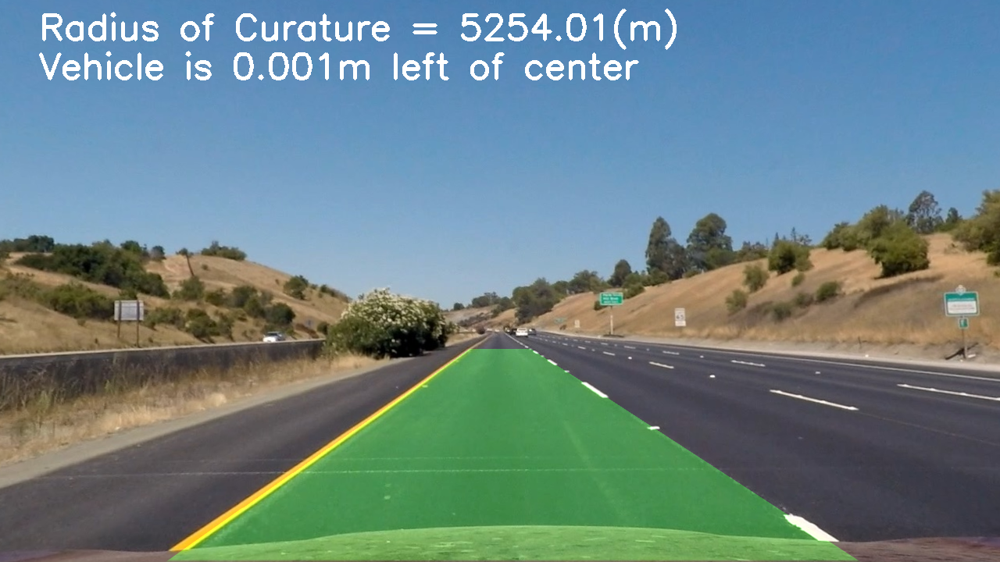

---

### Final Video output

這部份我有測試兩種不同長度的車道預測，透過兩個不同參數的俯視圖轉實現，而執行結果會有很大的差異。

```
src = np.float32([(596, 447), (683, 447), (1120, 720), (193, 720)])     # Longer line
src = np.float32([(578, 460), (704, 460), (1120, 720), (193, 720)])     # shorter line
```

1. **較短的車道預測**

[](https://www.youtube.com/watch?v=goPXW1jDSqI)


2. **較長的車道預測**

[](https://www.youtube.com/watch?v=rMXd7-9b_zE)

---

### Discussion

1. edge detection：這部份我花費最久的時間嘗試了許多的方法和參數，才能達到影片中的效能，但這樣並非完美的，如果換的其他影像仍有可能會失效，所以我們仍然可以從邊緣檢測來改進我們算法。

   ​

2. Brid View：這裡我也嘗試蠻多參數，如果我們車道太長轉換到俯視圖後車道線會變得十分模糊，所以在選取轉換的4個點時需要慎重考慮，上方影片就有顯示較短車道檢測相較於較長的車道檢測效能會更好。

   ​

3. 最後再影像輸出時我會將俯視圖也加到最後的影像輸出，這樣更方便之後再改進演算法。